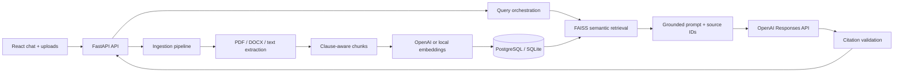

# Counsel — grounded legal document assistant

Counsel is a runnable end-to-end RAG application for asking questions about contracts, policies, agreements, and legal notes. It uploads and indexes PDF, DOCX, TXT, and Markdown files, searches only the active tenant's corpus, and returns structured answers with validated clause citations, risk flags, confidence, warnings, and source-document metadata.

The app is intentionally usable without an API key: local demo mode uses deterministic hashing embeddings and an extractive answer. Add an OpenAI API key to enable semantic embeddings and grounded synthesis through the Responses API.

> This software provides document analysis, not legal advice. Authentication headers in the demo are context scaffolding, not a production identity system.

## Architecture



Core features:

- Tenant- and document-scoped retrieval with `X-Tenant-ID` and `X-User-ID` context.
- PDF, DOCX, TXT, and Markdown extraction; scanned PDFs fail clearly and can be extended with OCR.
- Clause classification for termination, confidentiality, indemnity, liability, payment, governing law, privacy, IP, force majeure, and warranty.
- FAISS inner-product search with an automatic NumPy fallback.
- Grounded JSON-schema answers; model citation IDs are checked against retrieved chunks before returning them.
- Conversation history, document registry, duplicate detection, local object storage, and SQLite/PostgreSQL support.
- Responsive evidence-first React interface with uploads, corpus filters, summaries, risk flags, and a source inspector.

## Run locally

Prerequisites: Python 3.12+, Node.js 20+, and npm.

From the repository root in PowerShell:

```powershell
python -m venv .venv
.\.venv\Scripts\Activate.ps1
pip install -r backend\requirements-dev.txt
Copy-Item .env.example .env
uvicorn backend.app.main:app --reload
```

In a second terminal:

```powershell
cd frontend
npm install
npm run dev
```

Open `http://localhost:5173`, upload [`samples/sample-contract.md`](samples/sample-contract.md), and try: “What are the termination clauses?” FastAPI's interactive API documentation is at `http://localhost:8000/docs`.

### Enable OpenAI mode

Set this in `.env` and restart the API:

```dotenv
OPENAI_API_KEY=sk-...
OPENAI_MODEL=gpt-5.6-sol
EMBEDDING_PROVIDER=auto
EMBEDDING_MODEL=text-embedding-3-small
```

`gpt-5.6-sol` is the current flagship default selected for this build. For lower cost, set `OPENAI_MODEL=gpt-5.6-terra` after evaluating it on representative legal questions. The integration uses the Responses API, medium reasoning effort, structured outputs, `store=false`, and a hashed privacy-preserving safety identifier. See the official [model guidance](https://developers.openai.com/api/docs/guides/latest-model) and [`text-embedding-3-small` model page](https://developers.openai.com/api/docs/models/text-embedding-3-small).

Changing the embedding provider or model changes vector dimensions. Delete/re-upload existing demo documents (or run a migration/re-index job in production) after changing it.

## API

All data endpoints accept optional demo headers `X-Tenant-ID` and `X-User-ID`; they default to `demo-tenant` and `demo-user`. Set `REQUIRE_IDENTITY_HEADERS=true` and `APP_API_KEY` to make them mandatory for a protected development deployment.

| Method | Endpoint | Purpose |
|---|---|---|
| `GET` | `/api/v1/health` | Active LLM/embedding/vector mode |
| `GET` | `/api/v1/documents` | List the tenant's documents |
| `POST` | `/api/v1/upload-documents` | Extract, chunk, embed, and index files |
| `DELETE` | `/api/v1/documents/{id}` | Remove a document and its chunks |
| `POST` | `/api/v1/search` | Return ranked legal text chunks |
| `POST` | `/api/v1/ask` | Retrieve and answer with citations |
| `POST` | `/api/v1/summarize-document` | Structured summary using one document |

Example request:

```bash
curl -X POST http://localhost:8000/api/v1/ask \
  -H "Content-Type: application/json" \
  -H "X-Tenant-ID: demo-tenant" \
  -H "X-User-ID: demo-user" \
  -d '{"question":"What are the termination clauses?","top_k":6}'
```

The response includes `answer`, `citations`, `risk_flags`, `confidence`, `warning`, `source_documents`, `conversation_id`, `retrieval_used`, and `mode`.

## Run with Docker

```powershell
$env:OPENAI_API_KEY="sk-..."  # optional
docker compose up --build
```

Open `http://localhost:3000`. Docker Compose runs React behind nginx, FastAPI, and PostgreSQL; uploaded originals use a named local volume.

## Test and build

```powershell
pytest
ruff check backend
cd frontend
npm run lint
npm run build
```

## Production hardening checklist

- Replace trusted headers with OIDC/JWT validation and derive the tenant from server-side claims.
- Move originals to encrypted object storage; add malware scanning, retention controls, and signed download URLs.
- Add OCR for scanned documents and table-aware/legal-layout extraction for complex agreements.
- Replace automatic table creation with Alembic migrations and add database connection limits.
- For a large corpus, move filtered vector search to Pinecone, Weaviate, Chroma, or PostgreSQL/pgvector.
- Add per-tenant encryption/key management, audit logs, rate limits, deletion workflows, and PII controls.
- Create legal-domain retrieval and answer evals before changing chunking, prompts, models, or reasoning effort.
- Keep human review mandatory for advice, filing, negotiation, or other consequential legal decisions.

## Repository layout

```text
backend/app/              FastAPI routes, storage models, and service layer
backend/app/services/     Extraction, chunking, embeddings, retrieval, orchestration
backend/tests/            API, isolation, and chunking tests
frontend/src/             React client and evidence-first UI
samples/                  Fictional contract for trying the app
docker-compose.yml        PostgreSQL + API + nginx deployment
```
